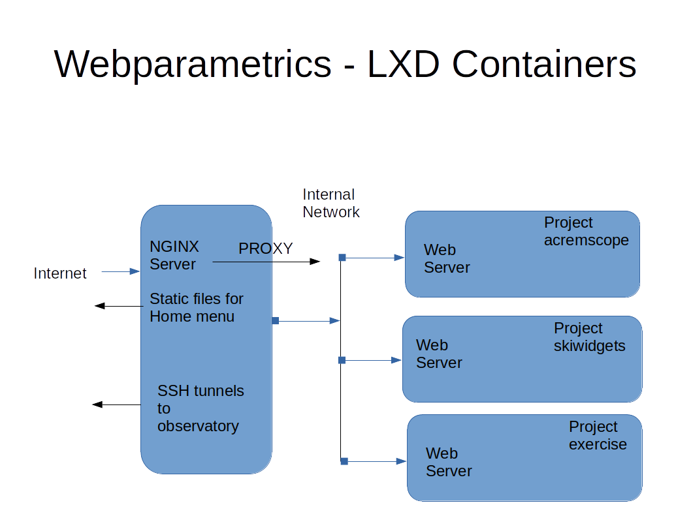

# Server build documentation

This documents a Virtual Private Server holding several test projects and builds. It will consist of a simple static web menu, served via nginx, and hold a number of LXD containers. Each container will be a separate project. If these projects serve html, the web menu will display links to directories serving each project.

The nginx configuration will act as a reverse proxy, forwarding calls to the appropriate lxd containers.

Therefore creating a new project is simple: create an lxd container and populate with the project. Alter the VPS host web menu to link to a directory. Add a proxy location in the nginx configuration which forwards calls to this directory to the container.

Removing a project is just reversing the above steps.

The VPS therefore needs to be configured with LXD, nginx, and certificates to serve https.

It needs ssh capability to allow remote access - via keys rather than passwords.

Include git capability, so projects on github can be easily cloned on the VPS.

The resultant service can be viewed at

[https://webparametrics.co.uk/](https://webparametrics.co.uk/)

The VPS has domains

webparametrics.com

webparametrics.co.uk

The VPS is from [www.ovh.co.uk](https://www.ovh.co.uk)

Ubuntu 20.04 Server (64-bit version)

38Gbits

IPv4 address is: 51.89.150.251

IPv6 address is: 2001:41d0:0801:2000:0000:0000:0000:212c

Name : vps806299.ovh.net

Manage at:

[https://www.ovh.com/manager](https://www.ovh.com/manager)

## Update the VPS

From the ovh kvm console, log in as root

apt-get update

apt-get upgrade

and reboot if the upgrade requests it

## Add user bernard

As root on the VPS

adduser bernard

and record the password

## From laptop, and any other PC you want, copy SSH keys

From laptop, desktop etc.,

ssh-copy-id bernard@51.89.150.251

This will ask for the user bernard password

so now the following works from laptop

ssh bernard@51.89.150.251

or even just

ssh 51.89.150.251

## Remove password login and root login via ssh

On the VPS as root:

/etc/ssh/sshd_config copied to sshd_config.original

in sshd_config edit the following

Set the line:

PasswordAuthentication yes

to

PasswordAuthentication no

PermitRootLogin yes

to

PermitRootLogin no

Also add the line

GatewayPorts clientspecified

which allows an ssh tunnel from a remote raspberry pi to the lxc network to be made

Followed by

systemctl restart ssh.service

## Install iptraf-ng

As root on the VPS:

apt-get install iptraf-ng

The command "iptraf-ng" starts a console traffic monitor. This can only be used by root, and is available for diagnostic purposes.

## Install nginx

apt-get install nginx

The server has two directories:

/etc/nginx/sites-available

/etc/nginx/sites-enabled

under sites-available you will see 'default', this points to static files at /var/www/html which contains the file index.nginx-debian.html which is the nginx welcome screen. Use a browser to check this is served

## Setup lxd on the VPS

as root:

usermod --append --groups lxd bernard

lxd init

accept defaults

log out completely, log in as bernard, try

lxc list

To show lxc is working. Note, the internal bridge lxdbr0 is:

IPv4 address for lxdbr0: 10.105.192.1

IPv6 address for lxdbr0: fd42:ad1d:ba59:dd49::1

## Set up container acremscope-db

This is the first project, a container serving a database for The Astronomy Centre Remscope.

Note Ubuntu 20.04 is a long tem support distribution, so, as user bernard:

lxc launch ubuntu:20.04 acremscope-db

lxc list

This gives container ip address 10.105.192.252

lxc exec acremscope-db -- /bin/bash

apt-get update

apt-get upgrade

apt-get install python3-pip

And to setup the container to serve a database, follow repository acremscope-db docs, but for now use crl-D to exit the container

## Getting certificate from letsencrypt

Back on the VPS, as root, following instructions at letsencrypt and https://certbot.eff.org/lets-encrypt/ubuntufocal-nginx

snap install core; snap refresh core

apt-get remove certbot

snap install --classic certbot

ln -s /snap/bin/certbot /usr/bin/certbot

certbot --nginx  -d webparametrics.co.uk -d www.webparametrics.co.uk -d webparametrics.com -d www.webparametrics.com

Try connecting with browser, should get https ok to the domains.

Test automatic renewal

certbot renew --dry-run

Also to see the certbot auto renewal timer, look at

systemctl list-timers

## Install git, and clone repositories

Note: git was found to be already installed on the ubuntu server, but local ssh public key needs copying to git

On the VPS, as user bernard, create an ssh key

ssh-keygen -t rsa -b 4096 -C "bernie@skipole.co.uk"

copy contents of .ssh/id_rsa.pub to github

clone any required repositories

git clone git@github.com:bernie-skipole/webparametrics.git

## Place static files under /var/www/html

On the VPS, copy static html files from the webparametrics repository
and place these under /var/www/html, owned by root

These should now be available by the web.

## Add project skitest

On the VPS, as user bernard.

lxc launch ubuntu:20.04 skitest

lxc list

This gives container ip address 10.105.192.227

lxc exec skitest -- /bin/bash

apt-get update

apt-get upgrade

apt-get install python3-pip

And to setup the container, follow repository skitest

and as root on the VPS, add the following location to the nginx configuration
/etc/nginx/sites-available/default

     location /test {
     proxy_pass http://10.105.192.227:8000;
     }

This should be in the server block which listens on port 443

Restart nginx with command "service nginx restart"

## Add project exercise

On the VPS, as user bernard.

lxc launch ubuntu:20.04 exercise

lxc list

This gives container ip address 10.105.192.40

lxc exec exercise -- /bin/bash

apt-get update

apt-get upgrade

apt-get install python3-pip

And to setup the container, follow repository exercise

and as root on the VPS, add the following location to the nginx configuration
/etc/nginx/sites-available/default

     location /exercise {
     proxy_pass http://10.105.192.40:8000;
     }

This should be in the server block which listens on port 443

Restart nginx with command "service nginx restart"

## Add project acremscope

On the VPS, as user bernard.

lxc launch ubuntu:20.04 acremscope

lxc list

This gives container ip address 10.105.192.83

lxc exec acremscope -- /bin/bash

apt-get update

apt-get upgrade

apt-get install python3-pip

And to setup the container, follow repository acremscope

and as root on the VPS, add the following location to the nginx configuration
/etc/nginx/sites-available/default

     location /acremscope {
     proxy_pass http://10.105.192.83:8000;
     }

This should be in the server block which listens on port 443

Restart nginx with command "service nginx restart"

